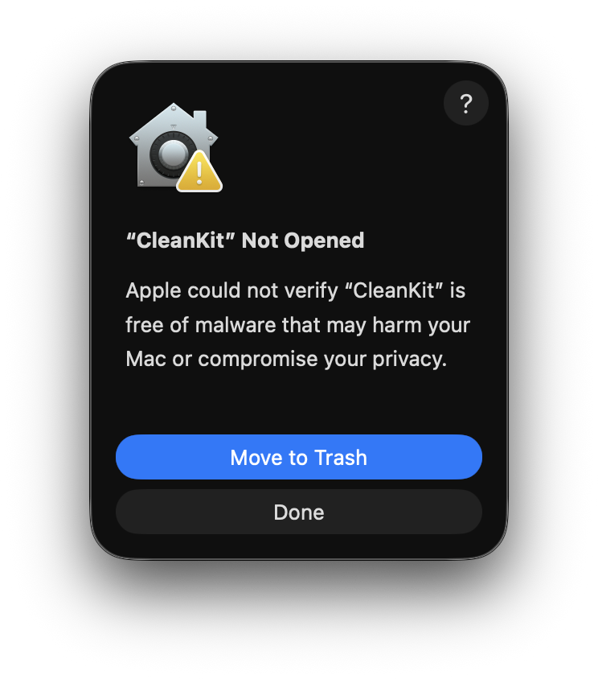
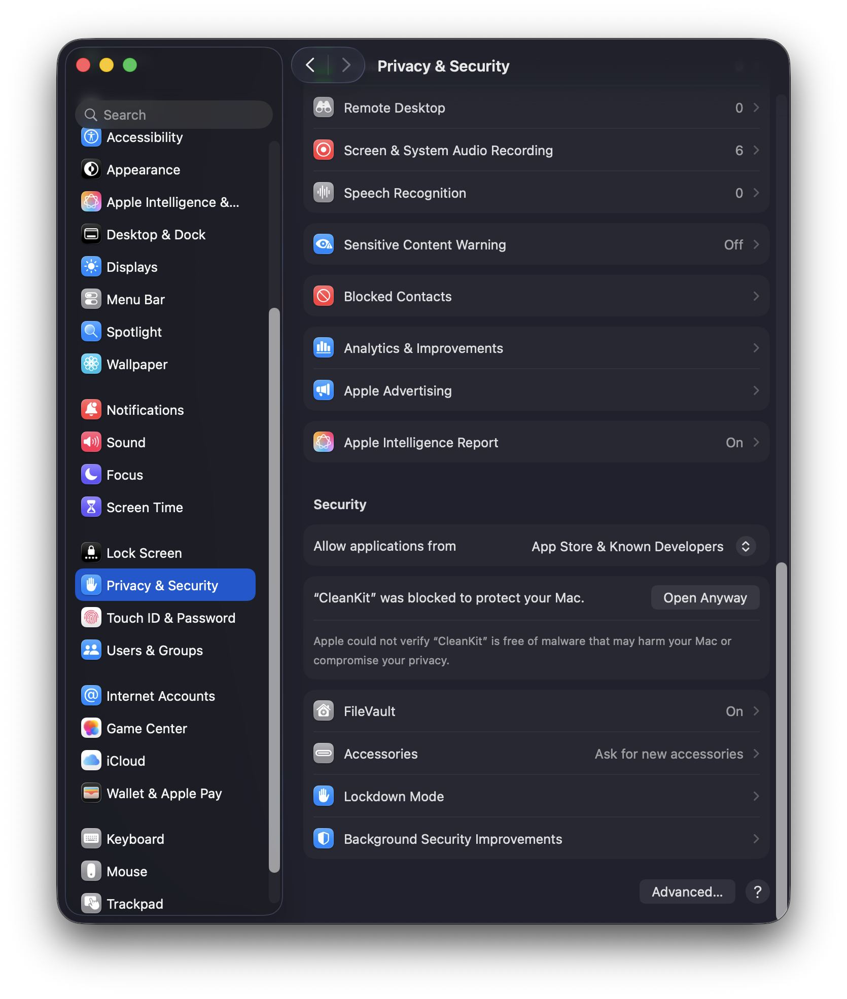
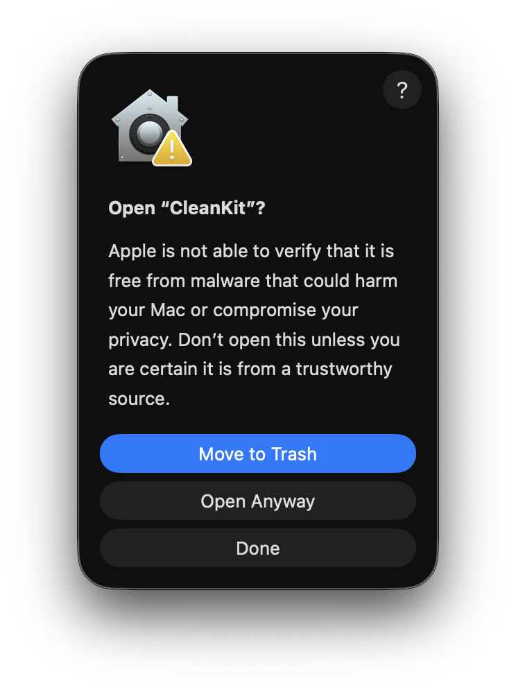

# CleanKit

A free, open-source Mac cleaner and developer toolkit for macOS.


CleanKit helps you reclaim disk space and keep your Mac clean. It scans developer caches, system junk, large files, duplicate files, and leftover app data — all in one place.

---

## Features

### Mac Cleaner
Scan and clean 55 categories across Developer tools, Apps, System, Logs, and Commands.


### Large File Finder
Find files taking up the most space. Filter by type, sort by size, and delete with one click.


### Duplicate Finder
3-pass content hashing to find exact duplicates. Choose what to keep — rest gets deleted.


### App Uninstaller
Remove apps along with their leftover preference files, caches, and support data.


### Settings
Control which categories appear, set large file thresholds, configure duplicate scan limits, and switch between Light, Dark, or System theme.


---

## Install

1. Download `CleanKit.dmg` from [Releases](https://github.com/azharbinanwar/CleanKit/releases)
2. Open the DMG and drag **CleanKit** to your Applications folder
3. Launch CleanKit from Applications

### First Launch — Security Warning

CleanKit is not notarized, so macOS will show security dialogs the first time you open it. Here's exactly what to do.

**Step 1** — Double-click CleanKit. macOS blocks it and shows this dialog.



Click **Done** (do not click Move to Trash).

**Step 2** — Open **System Settings → Privacy & Security**. Scroll down and you'll see a message that CleanKit was blocked.



Click **Open Anyway**.

**Step 3** — A final confirmation dialog appears.



Click **Open Anyway**. CleanKit will launch.

> You only need to do this once. After that, CleanKit opens normally.

---

## Build from Source

```bash
git clone https://github.com/azharbinanwar/CleanKit.git
cd CleanKit
open CleanKit.xcodeproj
```

Requires Xcode 16+ and macOS 15.0+.

---

## License

MIT — see [LICENSE](LICENSE)
